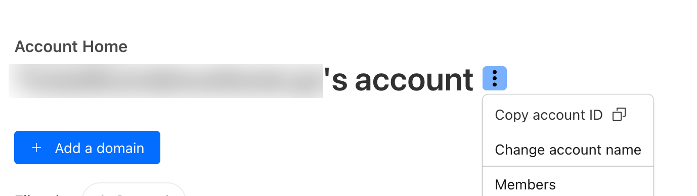
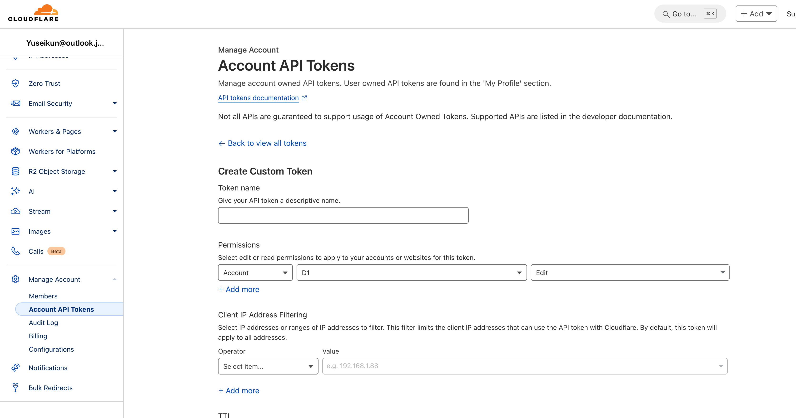

# D1 Database

このプロジェクトでは、[Cloudflare D1](https://developers.cloudflare.com/d1/)を主要なRDBとして使用しています。

## DBの初期設定

1. [Cloudflare](https://cloudflare.com/)のアカウントを作成
2. D1のdatabase `bibliophilia-db` を作成
```zsh
sh ./scripts/init-db.sh
```
4. `cp wrangler.example.toml wrangler.toml` で`wrangler.toml`を作成 
3. `wrangler.toml`の`database_id`を設定
5. `cp .env.example .env` で`.env`を作成
6. `.env` の Account IDを設定

7. D1 EditのpermissionのついたAPI Tokenを作成

8. `.env` にAPI Tokenを設定

## Migrationを生成

```zsh
npm run db:generate
```

## Migrationを適用

### ローカルで適用

```zsh
npm run db:apply
```

### 本番で適用

```zsh
npm run db:apply:prod
```

## Drizzle Studio

### ローカルのDBに対して起動

```zsh
npm run db:studio
```

### 本番のDBに対して起動

```zsh
npm run db:studio:prod
```
